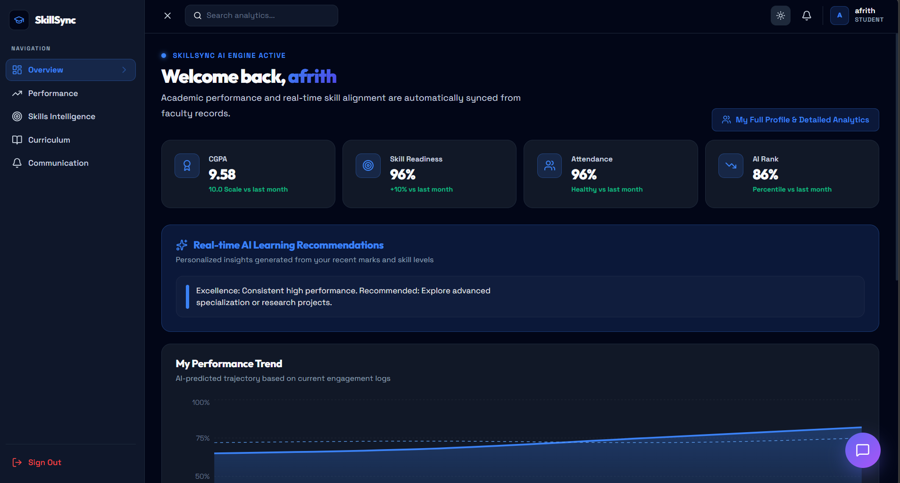
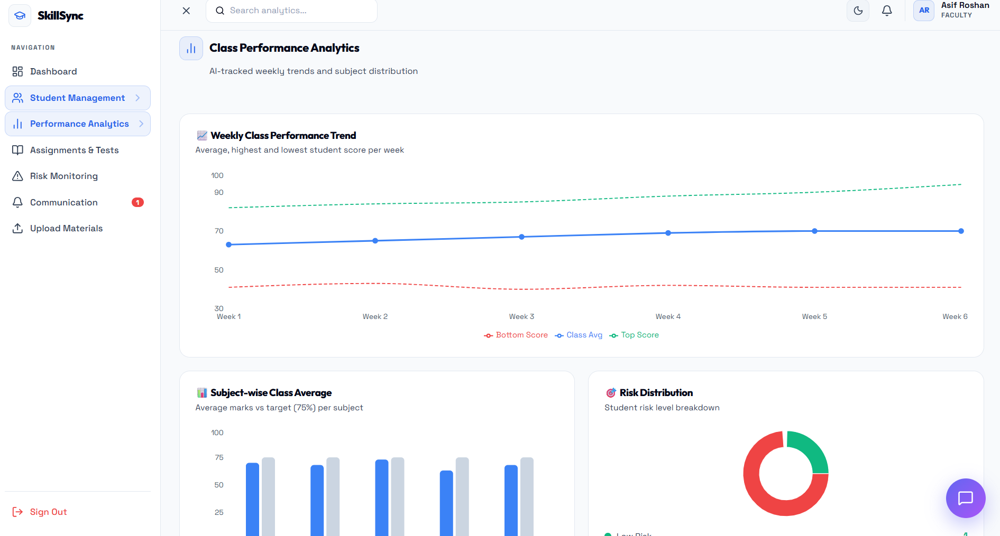
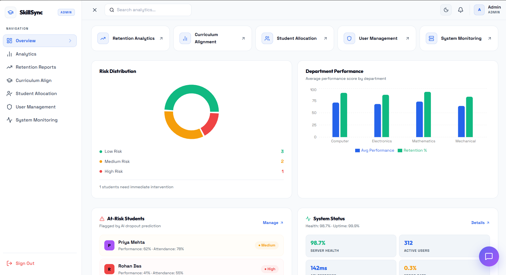

<div align="center">


# SkillSync

### AI-Powered Smart Education Platform

<p>
An intelligent platform that transforms academic data into actionable insights, enabling institutions to enhance student success, optimize learning paths, and align education with real-world industry demands.
</p>

</div>

---

## 🚀 Overview

**SkillSync** is a next-generation smart education platform designed to bridge the gap between **academic performance and industry expectations**.

It empowers institutions with intelligent tools to:

* Identify at-risk students early
* Analyze skill gaps based on real-world trends
* Generate personalized, career-focused learning paths

---

## ✨ Key Features

* **Predictive Dropout Detection**
  Proactively identify students at risk using performance analytics

* **Skill Gap Intelligence**
  Evaluate student capabilities against current industry requirements

* **Personalized Learning Roadmaps**
  Dynamic recommendations tailored to individual goals

* **Role-Based Dashboards**
  Dedicated interfaces for Students, Faculty, and Administrators

* **Real-Time Analytics**
  Monitor engagement, attendance, and academic performance

---

## 🖼️ Application Preview

### 🎓 Student Dashboard

<p align="center">
  
</p>

---

### 👨‍🏫 Faculty Dashboard

<p align="center">
  
</p>

---

### 🛠️ Admin Dashboard

<p align="center">
  
</p>

---

## ⚙️ Tech Stack

| Layer     | Technology                      |
| --------- | ------------------------------- |
| Frontend  | Next.js 15, React 19            |
| Backend   | Node.js, Express, TypeScript    |
| Database  | SQLite with Prisma ORM          |
| AI        | Google Gemini API               |
| Auth      | NextAuth.js                     |
| Styling   | Vanilla CSS, Framer Motion      |

---

## 🏗️ Architecture

The project is structured into three independent service directories:

- **`backend/`**: Express server handling API logic and AI processing.
- **`frontend/`**: Next.js client application.
- **`database/`**: Shared Prisma schema and SQLite database.

---

## 🚀 Getting Started

### 1. Backend Setup
1. Navigate to the backend folder:
   ```bash
   cd backend
   ```
2. Install dependencies:
   ```bash
   npm install
   ```
3. Initialize the database:
   ```bash
   npx prisma generate --schema=../database/prisma/schema.prisma
   ```
4. Start the backend:
   ```bash
   npm run dev
   ```
   *Runs on 👉 http://localhost:3001*

### 2. Frontend Setup
1. Open a new terminal and navigate to the frontend folder:
   ```bash
   cd frontend
   ```
2. Install dependencies:
   ```bash
   npm install --legacy-peer-deps
   ```
3. Start the frontend:
   ```bash
   npm run dev
   ```
   *Runs on 👉 http://localhost:4000*

---

## 👨‍💻 Author

**Muhammad Afrith**

A passionate Full Stack Developer focused on building scalable, intelligent, and user-centric applications.
Specializes in modern web technologies, AI-integrated systems, and real-world problem solving through innovative software solutions.

---

## ⭐ Support

If you find this project valuable:

* ⭐ Star the repository
* 🤝 Contribute to enhance features
* 📢 Share with the community

---

<div align="center">

Built with precision • Designed for impact • Driven by innovation

</div>
